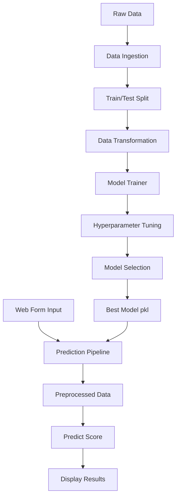
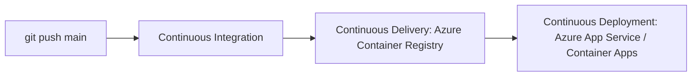

# Student Performance Prediction System

A comprehensive Machine Learning project designed to predict student academic performance (Math Score) based on various socio-economic and academic factors.

## 🚀 Overview

This project implements a complete end-to-end Machine Learning pipeline including data ingestion, transformation, model training, and a premium web interface for real-time predictions. The system uses advanced regression algorithms to provide accurate insights into student success factors.

## 🛠️ Tech Stack

- **Core**: Python 3.x
- **Machine Learning**: Scikit-learn, XGBoost, CatBoost, AdaBoost
- **Data Manipulation**: Pandas, NumPy
- **Web Interface**: Flask, HTML5, CSS3 (Modern Glassmorphic UI)
- **Environment Management**: Conda / Pip

## 🔄 Pipeline Workflow

### 1. Training Pipeline
The training pipeline handles the automated process of preparing data and creating the best model:
- **Data Ingestion**: Reads raw data from `notebook/data/student.csv`, performs a train-test split, and saves the results in the `artifacts/` folder.
- **Data Transformation**: Applies feature engineering, handles missing values (SimpleImputer), and performs scaling (StandardScaler) and encoding (OneHotEncoder).
- **Model Training**: Evaluates multiple regression models, tunes hyperparameters via GridSearchCV, and exports the best performing model as `model.pkl`.

### 2. Prediction Pipeline
The prediction pipeline is used by the web application for real-time inference:
- **Input**: Receives custom student data from the web form.
- **Preprocessing**: Loads the saved `preprocessor.pkl` and transforms the new input.
- **Inference**: Loads `model.pkl` and predicts the Math Score.



## 📁 Project Structure

```text
ML-Project/
├── app.py                  # Flask Application Entry Point
├── artifacts/              # Trained models and processed data
├── logs/                   # Application execution logs
├── notebook/               # Data exploration and training notebooks
│   └── data/               # Raw dataset (student.csv)
├── src/                    # Source code
│   ├── components/         # ML pipeline components
│   │   ├── data_ingestion.py
│   │   ├── data_transformation.py
│   │   └── model_trainer.py
│   ├── pipeline/           # Training and Prediction pipelines
│   │   ├── predict_pipeline.py
│   │   └── train_pipeline.py
│   ├── logger.py           # Logging configuration
│   ├── exception.py        # Custom exception handling
│   └── utils.py            # Utility functions
├── templates/              # HTML templates for the web app
├── setup.py                # Package configuration
└── requirements.txt        # Project dependencies
```

## ⚙️ Installation & Setup

1. **Clone the repository**:
   ```bash
   git clone https://github.com/yourusername/ML-Project.git
   cd ML-Project
   ```

2. **Create and activate a virtual environment**:
   ```bash
   conda create -n myenv python=3.10 -y
   conda activate myenv
   ```

3. **Install dependencies**:
   ```bash
   pip install -r requirements.txt
   ```

4. **Run the training pipeline** (optional, as artifacts are provided):
   ```bash
   python src/pipeline/train_pipeline.py
   ```

## 🖥️ Usage

1. **Start the Flask application**:
   ```bash
   python app.py
   ```

2. **Access the application**:
   Open your browser and navigate to `http://127.0.0.1:8080`

## 📊 Model Performance

The system evaluates multiple regression models (Random Forest, Decision Tree, Gradient Boosting, Linear Regression, XGBoost, CatBoost, AdaBoost) and automatically selects the best performer. The current best model achieves an **R2 Score of ~0.88**.

## ♾️ Continuous Integration & Deployment (CI/CD)

The recommended deployment path for this project is **GitHub Actions** building a Docker image and pushing it to **Azure Container Registry (ACR)**, then running it on **Azure App Service for Containers** or **Azure Container Apps**.



### 📦 1. Continuous Delivery (Build & Push to ACR)
On every push to the `main` branch, the workflow should:
- Build a Docker image from `python:3.10-slim-bookworm`.
- Install project dependencies, including `gunicorn` for production serving.
- Push the image to your Azure Container Registry repository.

### 🚀 2. Continuous Deployment (Run the Container on Azure)
Once the image is available, Azure should:
- Pull the newest image from ACR.
- Start the container with the web process bound to port `8080`.
- Set `WEBSITES_PORT=8080` for Azure App Service, or map the same port in Azure Container Apps.

### 🔑 Azure settings to confirm
If you deploy through GitHub Actions or a release pipeline, make sure the Azure app has the correct container and registry settings configured:

| Setting | Purpose | Example Value |
| :--- | :--- | :--- |
| `WEBSITES_PORT` | Port Azure App Service should route to | `8080` |
| `PORT` | Optional fallback port for container runtimes | `8080` |
| ACR image name | Docker image repository in Azure | `studentperformance` |
| Azure subscription / service principal | Auth for deployment automation | Your Azure credentials |

If you deploy the Docker image to Azure, the container will use Gunicorn and listen on `8080` by default.

## 📝 License

This project is licensed under the MIT License - see the [LICENSE](LICENSE) file for details.
